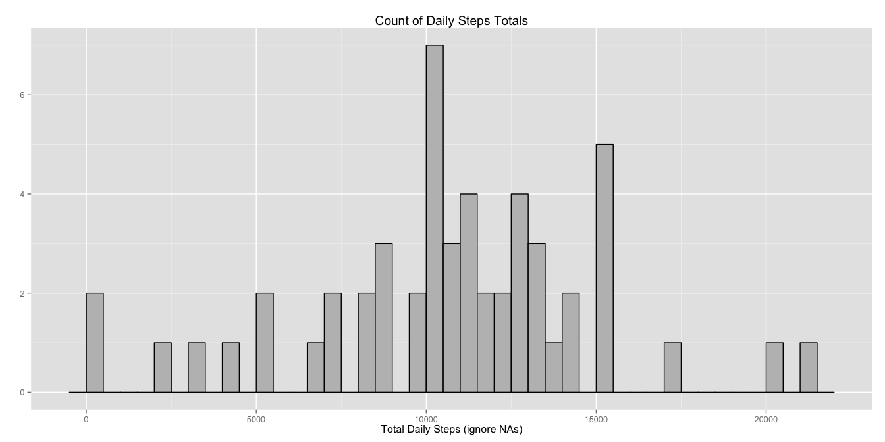

# Reproducible Research: Peer Assessment 1
Jim Pfleger  


## Loading and preprocessing the data

### Retrieve and unzip data file


```r
datafile <- 'activity.csv'
if (!file.exists(datafile)) {
  zip <- 'activity.zip'
  if (!file.exists(zip)) {
    download.file('https://d396qusza40orc.cloudfront.net/repdata%2Fdata%2Factivity.zip', zip, method = 'libcurl')
  }
  unzip(zip)
}
```

### Tidy data


```r
library(lubridate)
steps.raw <- read.csv(datafile)
steps.raw$date <- ymd(steps.raw$date)
steps.raw$interval <- factor(steps.raw$interval)
```


## What is mean total number of steps taken per day?

### Summarize by day


```r
library(dplyr, quietly = TRUE, warn.conflicts = FALSE)
steps.daily <- steps.raw %>% group_by(date) %>% summarize(steps = sum(steps))
```

### Histogram


```r
library(ggplot2)
g <- ggplot(steps.daily, aes(x = steps))
g <- g + geom_histogram(binwidth=500, color = 'black', fill = 'gray')
g <- g + labs(title = 'Count of Daily Steps Totals',
              x = 'Total Daily Steps',
              y = '')
g
```

 

### Summary statistics


```r
mean(steps.daily$steps, na.rm = TRUE)
```

```
## [1] 10766.19
```

```r
median(steps.daily$steps, na.rm = TRUE)
```

```
## [1] 10765
```

## What is the average daily activity pattern?


## Imputing missing values


## Are there differences in activity patterns between weekdays and weekends?
